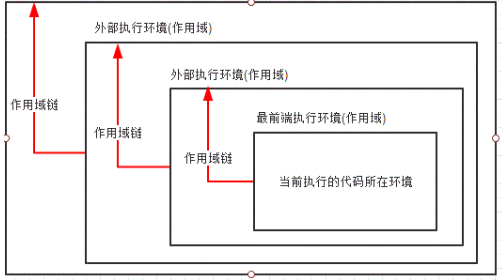

# 执行环境
## 描述
* **执行环境**：定义了变量和函数以及其他可以访问的数据。      
* 每个**执行环境**都有与之对应的**变量对象**，保存着环境中定义的各种*变量*和*函数*。*解析器*在处理的时候会用到，但是我们的代码无法访问。     
* 在浏览器云运行的时候会创建**执行环境**，调用函数时会创建**执行环境**。

## 分类
执行环境分成两种类型。
1. 全局执行环境   
是最外层的执行环境，在浏览器环境中，就是window对象。

2. 函数执行环境     
每个函数都有自己的执行环境，每进入一个函数时，函数的执行环境就被推到一个**环境栈**中。在函数执行完以后，这个执行环境会弹栈。      


# 作用域链
## 全局\局部作用域
与**全局执行环境**、**函数执行环境**的对应的，这里有**全局作用域**、**局部作用域**的概念。
* **全局作用域**：可以在代码的任何地方进行访问。
* **局部作用域**：一般仅在固定的代码片段内可以进行访问。     

## 作用域链
其实，全局与局部作用域的访问权限，是由**作用域链**决定的。     
为了搜索变量、函数，每进入一个新的**执行环境**都会创建一个**作用域链**。**作用域链**会保存，函数定义环境的（也就是当前函数的外层）有权访问的的变量和函数，
如下图所示。



* 作用域链的最前端始终是当前执行的代码所在环境的变量对象（如果该环境是函数，则将其活动对象作为变量对象），下一个变量对象来自包含环境（包含当前还行环境的环境），下一个变量对象来自包含环境的包含环境，依次往上，直到全局执行环境的变量对象。全局执行环境的变量对象始终是作用域链中的最后一个对象。

* 标识符解析是沿着作用域一级一级的向上搜索标识符的过程。搜索过程始终是从作用域的前端逐地向后回溯，直到找到标识符（找不到，就会导致错误发生）。

* 函数的局部环境可以访问函数作用域中的变量，也可以访问和操作父环境（包含环境）乃至全局环境中的变量。

* 父环境只能访问包含其的环境和自己环境中的变量和函数，不能访问其子环境中的变量和函数。

* 全局环境只能访问全局环境中的变量和函数，不能直接访问局部环境中的任何数据。


# 闭包
其实，函数的局部环境可以访问函数作用域中的变量，就是闭包。
```
function a(){
    let xxx = 1;
    log();
    function log(){
        console.log(xxx);
    }
}
```

# 提升（hoisting）
## 变量提升
```
var a = 1;
c();
function c(){
   console.log(a);   // undefined
   var a = 2; 
}
```
解析器在函数执行环境中发现变量a，因此不再上层查找。但是console.log（a）时还未赋值，所以打印undefined。上面的代码等价于：
```
var a = 1;
c();
function c(){
   var a;
   console.log(a);   // undefined
   a = 2; 
}
``` 
这种现象就是**变量提升**。    
注意，上面这段代码如果**var**改成**let**。
```
let a = 1;
c();
function c(){
   console.log(a);   // 报错
   let a = 2; 
}
```
此时，会形成**暂时性死区**，let在预解析过程中不会被提升。

## 函数提升
```
c()
function c(){
    //...
}
```
函数在预解析过程中也会发生提升现象。     
注意：**只有函数声明形式才能被提升！！**
```
c(); //会报错
var c = function(){

}
```


# 参考文献
* [JavaScript系列----作用域链和闭包](https://www.cnblogs.com/renlong0602/p/4398883.html)  
* [JavaScript中作用域和作用域链的简单理解（变量提升）](https://www.cnblogs.com/buchongming/p/5858026.html)