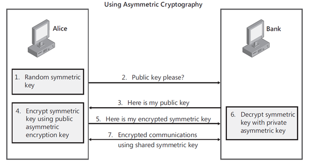
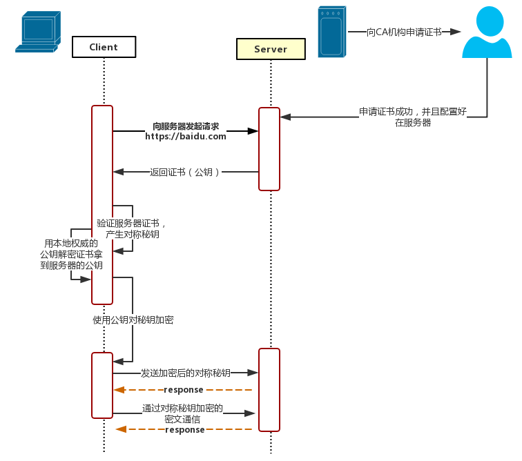

# 加密的基础概念

## 对称加密
对称加密是最快速、最简单的一种加密方式，**加密（encryption）与解密（decryption）用的是同样的密钥（secret key）**。由于它效率很高，所以被广泛使用在很多加密协议的核心当中。         
对称加密通常使用的是相对较小的密钥，一般小于256 bit。因为密钥越大，加密越强，但加密与解密的过程越慢。如果你只用1 bit来做这个密钥，那黑客们可以先试着用0来解密，不行的话就再用1解；但如果你的密钥有1 MB大，黑客们可能永远也无法破解，但加密和解密的过程要花费很长的时间。密钥的大小既要照顾到安全性，也要照顾到效率，是一个权衡。      
> 代表：AES

## 非对称加密   
非对称加密为数据的加密与解密提供了一个非常安全的方法，**它使用了一对密钥，公钥（public key）和私钥（private key）** 。      
**私钥**只能由一方安全保管，不能外泄。
**公钥**则可以发给任何请求它的人。
非对称加密使用这对密钥中的一个进行加密，而解密则需要另一个密钥。不需要将私钥通过网络发送出去，因此安全性大大提高。  

注意：非对称加密的一对密钥中选择哪个作**公钥**，哪个作**私钥**。完全看具体情况，不是固定的。      
如果您用于签名，那私钥签名，公钥验签；      
如果您用于加密，那公钥加密，私钥解密。    
（敲黑板）      
**公钥加密，私钥解密。---用于加解密**         
**私钥签名，公钥验签。---用于签名**  

> 代表：RSA
---     

## 配合     
虽然非对称加密很安全，但是和对称加密比起来，它非常的慢，所以我们还是要用对称加密来传送消息，但对称加密所使用的密钥我们可以通过非对称加密的方式发送出去。让两者之间相互配合。    

1. Alice需要在银行的网站做一笔交易，她的浏览器首先生成了一个随机数作为对称密钥。
2. Alice的浏览器向银行的网站请求公钥。
3. 银行将公钥发送给Alice。
4. Alice的浏览器使用银行的公钥将自己的对称密钥加密。
5. Alice的浏览器将加密后的对称密钥发送给银行。
6. 银行使用私钥解密得到Alice浏览器的对称密钥。
7. Alice与银行可以使用对称密钥来对沟通的内容进行加密与解密了。

# HTTPS

1. client向server发送请求 **https://baidu.com** ，然后连接到server的443端口。

2. **服务端准备证书**     
服务端必须要有一套数字证书，可以自己制作，也可以向组织申请。区别就是自己颁发的证书需要客户端验证通过，才可以继续访问，而使用受信任的公司申请的证书则不会弹出提示页面，这套证书其实就是一对公钥和私钥。

3. **传送证书**     
这个证书其实就是公钥，只是包含了很多信息，如证书的颁发机构，过期时间、服务端的公钥，第三方证书认证机构(CA)的签名，服务端的域名信息等内容。

4. **客户端解析证书**    
这部分工作是由客户端的TLS来完成的，首先会验证公钥是否有效，比如颁发机构，过期时间等等，如果发现异常，则会弹出一个警告框，提示证书存在问题。如果证书没有问题，那么就生成一个随即值（秘钥）。然后用证书对该随机值进行加密。

5. **传送加密信息**     
这部分传送的是用证书加密后的秘钥，目的就是让服务端得到这个秘钥，以后客户端和服务端的通信就可以通过这个随机值来进行加密解密了。

6. **服务段加密信息**     
服务端用私钥解密秘密秘钥，得到了客户端传过来的私钥，然后把内容通过该值进行对称加密。

7. **传输加密后的信息**     
这部分信息是服务端用私钥加密后的信息，可以在客户端被还原。

8. **客户端解密信息**     
客户端用之前生成的私钥解密服务端传过来的信息，于是获取了解密后的内容。

# 参考文献
* [1] [对称加密与非对称加密](http://www.cnblogs.com/jfzhu/p/4020928.html)
* [2] [HTTPS那些事（一）HTTPS原理](https://www.cnblogs.com/jfzhu/p/4064035.html)
* [3] [HTTPS那些事（二）SSL证书](https://www.cnblogs.com/jfzhu/p/4064055.html)
* [4] [HTTPS工作原理](https://www.cnblogs.com/svan/p/5090201.html)
* [5] [HTTPS原理解析](https://www.cnblogs.com/zery/p/5164795.html)