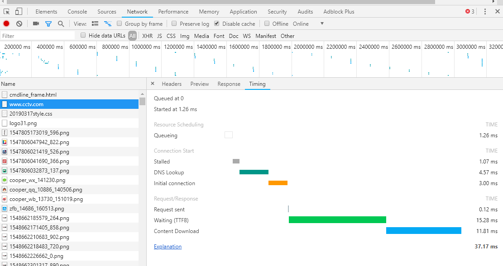

在Chrome浏览器的开发者工具里的**Network**抓包工具，相信大家再熟悉不过。     
但，我相信很多人跟我一样，不太了解抓包工具里每个请求对应的数据参数的具体含义。我今天要做的，就是跟大家一道逐一研究一下各部分内容的含义。   

## Queueing
文件请求的排队时间，在**http/1.x**基础上，必须按照顺序请求文件。   

> 如果您对此部分内容不太清楚，建议阅读我整理的关于[HTTP](HTTP.md)的内容。

## Stalled 
是浏览器得到要发出这个请求的指令到请求可以发出的等待时间。等什么呢？一般是等待可复用的TCP连接释放。

> 通常情况下，此部分时间不会太长。有一次，同事反馈说打不开网站了。结果，是因为他绑定了错误的host。      

## DNS Lookup 
时间执行DNS查找。每个新域页面请求-DNS查找一个完整的往返。     
DNS查询的时间，当本地DNS缓存没有的时候，这个时间可能是有一段长度的；    
但是第二次访问，由于浏览器的DNS缓存还在，这个时间就为0了。（或者绑定HOST）   

> 如果您对此部分内容不太清楚，建议阅读我整理的关于[DNS](DNS.md)的内容。

## Initial connection 
建立TCP连接的时间，就相当于客户端从发请求开始到TCP握手结束这一段，我的理解是TCP握手时间。      

> 如果您对此部分内容不太清楚，建议阅读我整理的关于[TCP](TCP.md)的内容。      

## Request sent
请求第一个字节发出前到最后一个字节发出后的时间，也就是**上传时间**。通常GET请求速度非常快的。      

## Waiting（TTFB（Time To First Byte））   
请求发出后，到收到响应的第一个字节所花费的时间,发送请求完毕到接收请求开始的时间;       
这个时间段就代表**服务器处理和返回数据**，以及**网络延时时间**了。     
服务器优化的目的就是要让这个时间段尽可能短。      

通常的做法有：      
* MySql建立索引，优化SQL语句，减少慢查询，提高响应速度   
* 对热门资源构建缓存，提高响应速度       
* 构建CDN（内容分发网络），减少网络延迟      

等一系列手段吧。   

## Content Download 
收到响应的第一个字节，到接受完最后一个字节的时间，就是下载时间。

> 通常不会太长，如果时间特别长，可以关注一下文件大小。在保证展示效果的基础上，尽量用压缩比高的图片格式。相同展示效果的基础上，用jpg明显小于png。    
> 对了google有一个新的图片格式**webp**，图片尺寸会降低50%左右。

如果感兴趣的话可以阅读一下[探究WebP一些事儿](https://aotu.io/notes/2016/06/23/explore-something-of-webp/)

