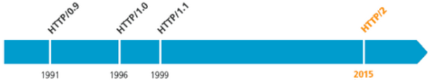

# 各个版本HTTP协议
## 发展
在HTTP建立之初，主要是为了传输超文本标记语言(HTML)文档。随着时代的发展，也进行了若干次演进。下图是各个版本发布的时间轴。           
 
           
目前为止，使用最为广泛的是**http1.1**，**http1.0**应该比较少了，最新的是**http2**。     
这篇博文也主要，围绕着1.0、1.1、2.0三个版本进行介绍。
## HTTP 1.0

## HTTP 1.1

## HTTP 2.0
